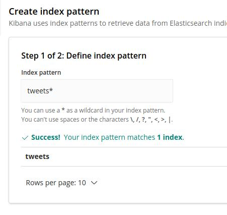

# Doing a pipeline with Twitter, Flink and ElasticSearch
**This project was created to make an implementation of an exercise proposed by the course [ Apache Flink | A Real Time & Hands-On course on Flink ](https://www.udemy.com/course/apache-flink-a-real-time-hands-on-course-on-flink/). More features was added like insertions on ElasticSearch and filters in a query to treat the API's response, The filters in the application search for "Bolsonaro" and "Moro", because there were a lot of political events at the time**

---

# Techs
* Scala
* Apache Flink
* Apache Kafka
* Twitter API
* ElasticSearch
* Docker
* Shell

---
# Necessary Resources
* Java 11 
* [Docker](https://www.docker.com/) and [Docker-Compose](https://docs.docker.com/compose/install/)
* [Scala](https://www.scala-lang.org/download/) (2.12.11)
* [SBT](https://www.scala-sbt.org/download.html) (1.3.10)
* [Twitter](https://developer.twitter.com/en) developer account

---
# Attention
* After your developer account was created you need to put your keys like an [Environment Variables](https://linuxize.com/post/how-to-set-and-list-environment-variables-in-linux/). **They need to have these names** (TWITTER_CONSUMER_TOKEN_KEY, TWITTER_CONSUMER_TOKEN_SECRET, TWITTER_ACCESS_TOKEN_KEY, TWITTER_ACCESS_TOKEN_SECRET) . [1]
* Check if don't have any service running on the ports 2181, 5601, 9200 and 9092, else your docker-compose will not build the cointainer. If you can't kill the service you can change the port in ```docker-compose.yml``` [2].

# How to run (Linux - Ubuntu)
* In your terminal go to the root of the project and run the command "```./run.sh```" to start the application.
* For visualize your data, access```localhost:5601```, click in "Discover", create an index pattern [3] and refresh your page and you will can see all the inserted tweets.
* For finalize your application, close the Kafka and Flink terminals and, in a root of the project, open another terminal and run the command ```docker-compose down --volumes```.


---
[1] If you don't want to put your keys in env variables or you couldn't, just got to the class ```com.github.example.util.utils``` and change th ```System.getenv()``` to your key like a String (```.setOauthConsumerKey("your_consumer_key_here")```).
```
val config = new twitter4j.conf.ConfigurationBuilder()
    .setOAuthConsumerKey(System.getenv("TWITTER_CONSUMER_TOKEN_KEY"))
    .setOAuthConsumerSecret(System.getenv("TWITTER_CONSUMER_TOKEN_SECRET"))
    .setOAuthAccessToken(System.getenv("TWITTER_ACCESS_TOKEN_KEY"))
    .setOAuthAccessTokenSecret(System.getenv("TWITTER_ACCESS_TOKEN_SECRET"))
    .setTweetModeExtended(true)
    .setJSONStoreEnabled(true)
    .build
```

[2] In the tag ```ports```, change the left value to another port and run ```docker-compose up -d``` again.
```
zookeeper:
    container_name: zookeeper
    image: wurstmeister/zookeeper
    restart: "always"
    ports:
      -  "2181:2181"
```

[3] Index Pattern Creation.


